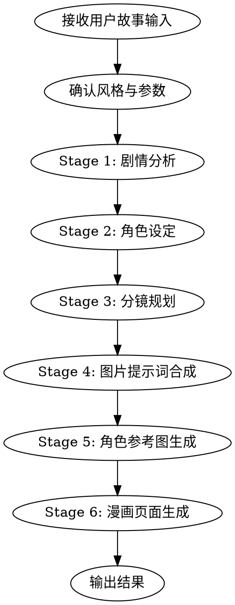

# AI 漫画创作 Agent Workflow

输入一段故事或提示词，产出完整漫画页面图片。

## 执行流程



## Step 0: 接收输入 & 确认参数

从用户获取：
- **故事文本**（必须）：可以是一句话概念、一段剧情、或完整小说章节
- **风格**（可选，默认 neo_chinese）：见下方风格表
- **页数**（可选，默认 4-6 页）
- **每页分格数**（可选，默认 3）

风格预设表：

| ID | 中文名 | 适合题材 |
|----|--------|----------|
| `ink_wash` | 水墨风漫画 | 仙侠、古风战斗 |
| `gongbi` | 工笔重彩漫画 | 宫廷、玄幻、历史 |
| `neo_chinese` | 线性新国风漫画 | 现代商业插图 |
| `baimiao` | 白描武侠漫画 | 武侠、快节奏打斗 |
| `guochao_chibi` | 国潮Q版漫画 | 日常、搞笑、治愈 |
| `dark_gothic` | 暗黑志怪风漫画 | 悬疑、志怪奇幻 |
| `exquisite_3d_donghua` | 国风3D精美动漫 | 仙侠、古装奇幻、史诗动作 |

如果用户未指定风格，根据故事题材自动选择最匹配的预设。

## Step 1: 剧情分析

对用户故事文本执行 LLM 分析，输出结构化 JSON：

```
你是一位专业漫画编剧。分析以下故事，输出 JSON：

{
  "title": "漫画标题",
  "theme": "核心主题",
  "characters": [
    {
      "code": "唯一标识如 protagonist_lin",
      "name": "角色名",
      "role": "主角/配角/反派",
      "appearance": "详细外貌：脸型、五官、发型发色、体型、标志性特征",
      "personality": "性格特征",
      "signature_outfit": "标志性服装描述"
    }
  ],
  "plot_beats": [
    { "beat": "情节点描述", "emotion": "情绪基调", "intensity": 1-10 }
  ],
  "visual_motifs": ["反复出现的视觉意象"],
  "settings": [
    { "name": "场景名", "description": "环境描述", "atmosphere": "氛围" }
  ]
}

故事文本：
{user_story}
```

## Step 2: 角色设定

基于 Step 1 的角色列表，为每个角色生成视觉一致性描述：

```
基于以下角色信息，为每个角色生成图像生成用的视觉锚点描述。
要求：
- 描述必须足够具体，使不同图片中同一角色外貌一致
- 包含：脸型、眼睛形状与颜色、眉形、鼻型、唇形、肤色、发型发色、体型比例
- 包含标志性服装/配饰的精确描述
- 输出为可直接嵌入图像提示词的文本段落

角色列表：
{characters_from_step_1}

输出格式：
{
  "character_prompts": [
    {
      "code": "protagonist_lin",
      "name": "林夜",
      "visual_anchor": "一段200字以内的角色视觉描述，可直接用于图像提示词"
    }
  ]
}
```

## Step 3: 分镜规划

将剧情拆分为具体的漫画页面分镜：

```
你是一位专业漫画分镜师。基于以下剧情分析，生成 {page_count} 页漫画的分镜脚本。
每页包含 {panels_per_page} 格。

要求：
- 开场页用全景/远景建立世界观
- 情绪高潮用特写/大特写强化冲击
- 对话场景用中景交替切换
- 动作场景用斜线构图增加动感
- 保持叙事节奏：起承转合

剧情分析：{step_1_output}
角色设定：{step_2_output}

输出格式：
{
  "pages": [
    {
      "page_number": 1,
      "panels": [
        {
          "panel_index": 1,
          "shot_type": "全景/中景/近景/特写/大特写/鸟瞰",
          "description": "画面内容描述",
          "characters_present": ["protagonist_lin"],
          "dialogue": "对话文字（如有）",
          "emotion": "情绪基调",
          "camera_angle": "平视/俯视/仰视/斜角",
          "scene": "场景名"
        }
      ]
    }
  ]
}
```

## Step 4: 图片提示词合成

将分镜 + 角色视觉锚点 + 风格预设合成为最终图像生成提示词。每页一个提示词（多格合并为一张图）：

```
对每一页，按以下模板合成提示词：

---
[风格前缀]
漫画分格布局：{panels_per_page}格漫画页面，从上到下/从左到右排列。

第1格（{shot_type}）：{description}
角色：{character_visual_anchor}
镜头：{camera_angle}

第2格（{shot_type}）：{description}
角色：{character_visual_anchor}
镜头：{camera_angle}

第3格（{shot_type}）：{description}
角色：{character_visual_anchor}
镜头：{camera_angle}

对话气泡文字：{dialogue_text}
场景环境：{scene_description}
整体氛围：{emotion}
---
```

风格前缀映射：

| 风格 ID | 提示词前缀 |
|---------|-----------|
| `ink_wash` | 中国水墨画风格漫画，宣纸质感，墨色浓淡变化，留白构图，飞白笔触，写意与工笔结合 |
| `gongbi` | 中国工笔重彩风格漫画，精细线描，矿物颜料质感，金碧辉煌，层层渲染，华丽细腻 |
| `neo_chinese` | 现代新国风线性漫画，干净利落的线条，柔和渐变配色，时尚插画质感，东方美学与现代设计融合 |
| `baimiao` | 白描线稿风格漫画，纯线条表现，无色彩填充，笔力遒劲，速度感线条，武侠气韵 |
| `guochao_chibi` | 国潮Q版漫画风格，大头小身比例，圆润可爱，鲜艳撞色，中国传统纹样装饰元素 |
| `dark_gothic` | 暗黑中式志怪风格漫画，阴郁色调，诡异氛围，精细暗部细节，哥特与东方妖怪美学融合 |
| `exquisite_3d_donghua` | 国风3D渲染精美动漫风格，高精度建模质感，电影级光影，仙侠古装，华丽粒子特效 |

## Step 5: 角色参考图生成（可选）

如果需要角色一致性，先为主要角色生成参考图：

```
为以下角色生成角色设定参考图。
要求：正面半身像，白色背景，清晰展示面部特征和服装细节。

{character_visual_anchor}

风格：{style_prefix}
```

使用图像生成工具生成参考图，后续页面生成时作为 reference 传入。

## Step 6: 漫画页面生成

对 Step 4 产出的每个页面提示词，调用图像生成：

- **尺寸**：竖版漫画页推荐 `1024x1536` 或 `768x1152`
- **模型**：使用可用的图像生成模型（如 gpt-image-2）
- **逐页生成**：每页独立生成，确保质量

生成后将所有页面图片按顺序保存到 `generated-assets/` 目录。

## Step 7: 输出结果

向用户展示：
1. 所有生成的漫画页面图片（按页码顺序）
2. 角色设定总结
3. 分镜脚本概要

如果某页生成失败，报告错误并提供重试该页的选项。

## 执行要点

- **角色一致性**：每页提示词必须包含完整的角色视觉锚点描述，不能省略
- **风格一致性**：每页提示词必须以相同的风格前缀开头
- **对话文字**：中文对话气泡文字写入提示词，要求清晰可读
- **分格布局**：明确指定每页的分格数量和排列方式
- **渐进输出**：每生成一页就展示给用户，不要等全部完成

## 快速启动示例

用户输入：
> 写一个关于少年剑客在雨夜酒馆遇到神秘老者的故事，4页漫画，水墨风

Agent 执行：
1. 分析剧情 → 提取角色（少年剑客、神秘老者、酒馆老板）+ 场景（雨夜酒馆）
2. 角色设定 → 生成三人视觉锚点
3. 分镜规划 → 4页 × 3格 = 12格分镜
4. 提示词合成 → 4个完整页面提示词（水墨风前缀）
5. 生成图片 → 4张漫画页面
6. 输出 → 展示4页漫画 + 角色卡 + 分镜表
